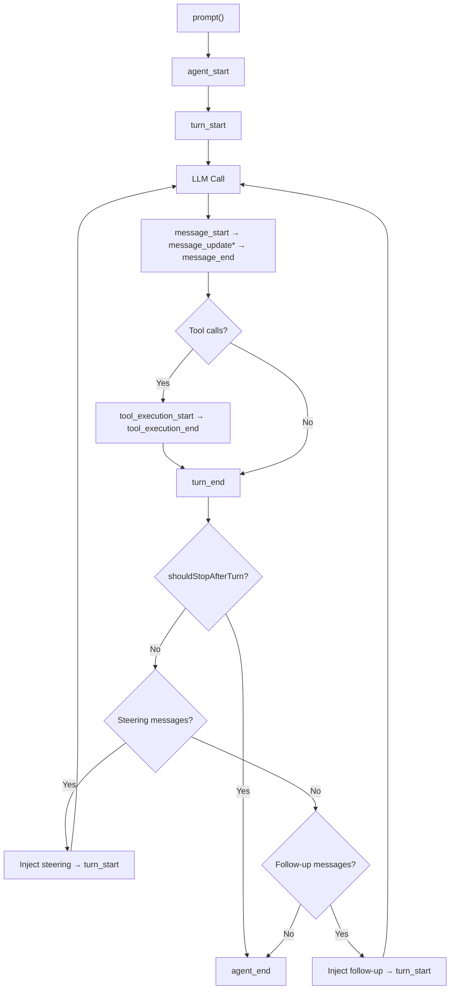
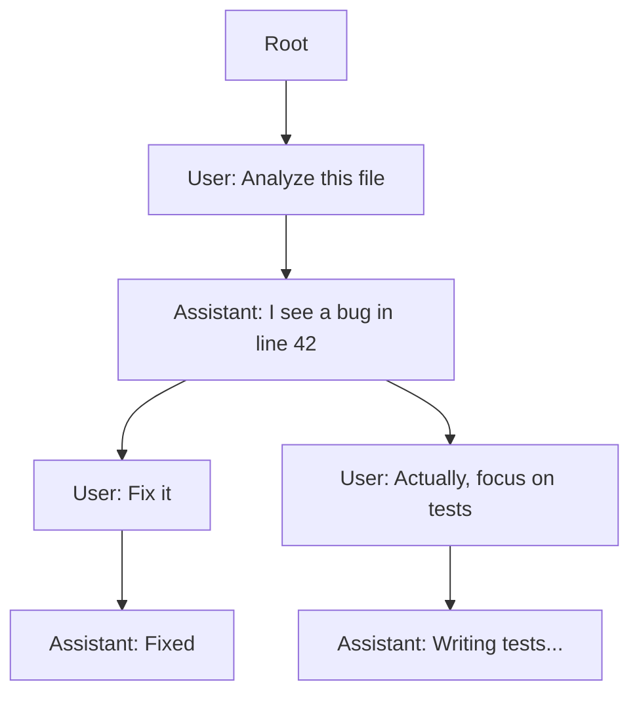
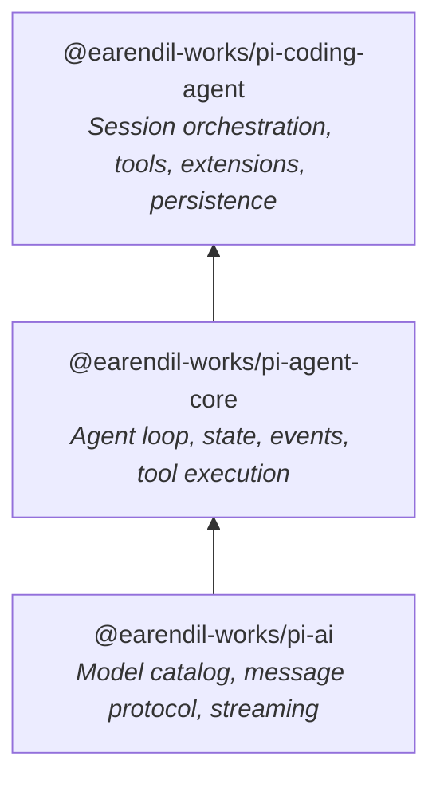

# Pi SDK: Under the Hood

Comprehensive technical documentation for building sandboxed autonomous agent workflows with the `@earendil-works/pi-coding-agent`, `@earendil-works/pi-agent-core`, and `@earendil-works/pi-ai` SDK packages.

---

## Documentation Map

| Quadrant | Purpose |
|---|---|
| [🎓 Tutorial](#tutorial-build-your-first-autonomous-agent) | Acquire competence — build a working headless agent from scratch |
| [🔧 How-to Guides](#how-to-guides) | Apply skills — task-oriented recipes for sandboxing, steering, and extending |
| [📖 Reference](#reference) | Look up API details — exhaustive, austere, factual |
| [💡 Explanation](#explanation) | Understand the system — architecture, design philosophy, lifecycle |

---

# 🎓 Tutorial: Build Your First Autonomous Agent

We are going to build a headless agent that sends a prompt to an LLM, streams the response token-by-token, executes tool calls, and logs every lifecycle event to a JSONL file. By the end, you will have a working autonomous agent script you can extend for any sandboxed workflow.

## Prerequisites

We will use the following:
- Node.js 20+
- TypeScript with ESM (`"type": "module"` in `package.json`)
- An API key for a supported provider (we will use Google Gemini)

## Step 1: Set up the project

Create a new directory and initialize it.

```bash
mkdir pi-agent-sandbox && cd pi-agent-sandbox
npm init -y
npm install @earendil-works/pi-coding-agent @earendil-works/pi-ai
```

Add `"type": "module"` to your `package.json`. We will write our agent in `index.ts`.

## Step 2: Import the SDK primitives

Open `index.ts`. We need four things from the SDK: credential storage, a model registry, a session manager, and the session factory.

```typescript
import {
  AuthStorage,
  createAgentSession,
  ModelRegistry,
  SessionManager,
} from "@earendil-works/pi-coding-agent";
import { getModel } from "@earendil-works/pi-ai";
```

Notice that we import `getModel` from `pi-ai` — this is the model catalog. Everything else comes from `pi-coding-agent`, which is the orchestration layer.

## Step 3: Initialize the runtime

We need to set up the credential pipeline and select a model. `AuthStorage` manages API keys, and `ModelRegistry` resolves them at call time.

```typescript
const authStorage = AuthStorage.create();
const modelRegistry = ModelRegistry.create(authStorage);
const model = getModel("google", "gemini-3-flash-preview");
```

Now we create the session. `SessionManager.inMemory()` gives us a session that lives only in process memory — no files on disk, perfect for ephemeral sandbox runs.

```typescript
const { session } = await createAgentSession({
  sessionManager: SessionManager.inMemory(),
  authStorage,
  modelRegistry,
  model,
});
```

The `createAgentSession` factory returns an object containing the `session` (an `AgentSession` instance). This is the primary handle for all agent operations.

## Step 4: Subscribe to lifecycle events

Before we send a prompt, we subscribe to the event stream. This is how we observe everything the agent does.

```typescript
import { appendFile } from "node:fs/promises";
import { mkdirSync, existsSync } from "node:fs";

const logsDir = "./logs";
if (!existsSync(logsDir)) mkdirSync(logsDir);

session.subscribe(async (event) => {
  // Log every event to a JSONL file
  await appendFile(
    `${logsDir}/${session.sessionId}.jsonl`,
    JSON.stringify(event) + "\n"
  );

  // Stream text deltas to stdout
  if (
    event.type === "message_update" &&
    event.assistantMessageEvent.type === "text_delta"
  ) {
    process.stdout.write(event.assistantMessageEvent.delta);
  }
});
```

Every agent event flows through this subscription — `agent_start`, `turn_start`, `message_start`, `message_update`, `tool_execution_start`, `tool_execution_end`, `turn_end`, `agent_end`. We will explore these in detail in the [Explanation: Agent Lifecycle](#explanation-the-agent-lifecycle) section.

## Step 5: Send a prompt

```typescript
await session.prompt("List the files in the current directory and describe what you see.");
console.log("\n--- Agent finished ---");
```

Run it:

```bash
npx tsx index.ts
```

You will see the LLM response streaming to your terminal. If the agent has tools enabled (it does by default — bash, read, edit, write, grep, find, ls), it will execute an `ls` or `bash` command and describe the output.

## Step 6: Inspect the log

Open the JSONL file in `./logs/`. Each line is a single `AgentEvent`. You will see the full lifecycle: the agent started, a turn began, the LLM generated a message with tool calls, the tools executed, and the agent ended.

**Congratulations.** You now have a functioning autonomous agent. The next sections show you how to sandbox it, steer it mid-run, and extend it with custom tools.

---

# 🔧 How-to Guides

## How to Build a Sandboxed Agent Pipeline

### Restrict the working directory

To confine all file operations to a specific directory, set the `cwd` option. All built-in tools (bash, read, edit, write, grep, find, ls) resolve paths relative to this directory.

```typescript
const { session } = await createAgentSession({
  sessionManager: SessionManager.inMemory(),
  authStorage,
  modelRegistry,
  model,
  cwd: "/tmp/sandbox-workspace",
});
```

### Restrict the tool set

To limit which tools the agent can use, pass `tools` or `readOnlyTools`:

```typescript
import { createReadOnlyTools } from "@earendil-works/pi-coding-agent";

const { session } = await createAgentSession({
  sessionManager: SessionManager.inMemory(),
  authStorage,
  modelRegistry,
  model,
  cwd: "/tmp/sandbox-workspace",
  readOnlyTools: true,  // Only read, grep, find, ls — no bash, edit, write
});
```

For fine-grained control, provide explicit `customTools`:

```typescript
import { createToolDefinition } from "@earendil-works/pi-coding-agent";

const { session } = await createAgentSession({
  // ...
  customTools: [
    createToolDefinition("read", "/tmp/sandbox-workspace"),
    createToolDefinition("grep", "/tmp/sandbox-workspace"),
  ],
});
```

### Use file-backed sessions for persistence

Replace `SessionManager.inMemory()` with a file-backed session to persist conversation state across process restarts:

```typescript
const sessionManager = SessionManager.create("/path/to/sessions-dir");

const { session } = await createAgentSession({
  sessionManager,
  // ...
});
```

The session manager writes an append-only JSONL file. On restart, it replays entries to reconstruct state.

### Inject a custom system prompt

```typescript
const { session } = await createAgentSession({
  // ...
  systemPrompt: "You are a security auditor. Only analyze code for vulnerabilities.",
  appendSystemPrompt: ["Never execute destructive commands."],
});
```

`systemPrompt` replaces the default. `appendSystemPrompt` adds additional rules after the default system prompt.

---

## How to Steer and Follow Up During a Run

### Steer the agent mid-turn

Steering messages are injected after the current assistant turn finishes, before the next LLM call. Use this to redirect the agent while it is working.

```typescript
// While the agent is streaming...
session.steer("Focus on the authentication module, not the UI.");
```

### Queue a follow-up

Follow-up messages are delivered only after the agent would otherwise stop (no more tool calls, no steering messages). Use this for chained tasks.

```typescript
session.followUp("Now write unit tests for the code you just created.");
```

### Control queue draining

By default, all queued messages drain at once. To process them one at a time:

```typescript
session.steeringMode = "one-at-a-time";
session.followUpMode = "one-at-a-time";
```

### Abort a running agent

```typescript
session.abort();
```

This sends an abort signal to the active run. Tool executions receive the signal and should terminate gracefully. The agent emits `agent_end` after abort.

### Wait for the agent to finish

```typescript
await session.waitForIdle();
// Safe to read state, send new prompts, or shut down
```

---

## How to Register Custom Tools and Extensions

### Register a tool via extension factory

If using `createAgentSession` with extensions enabled, provide an `ExtensionFactory`:

```typescript
import { Type } from "typebox";
import type { ExtensionFactory } from "@earendil-works/pi-coding-agent";

const myExtension: ExtensionFactory = (pi) => {
  pi.registerTool({
    name: "count_lines",
    label: "Count Lines",
    description: "Counts lines in a file",
    parameters: Type.Object({
      filePath: Type.String({ description: "Path to the file" }),
    }),
    async execute(toolCallId, params, signal) {
      const { execSync } = await import("node:child_process");
      const count = execSync(`wc -l < "${params.filePath}"`)
        .toString()
        .trim();
      return {
        content: [{ type: "text", text: `${count} lines` }],
        details: { lineCount: parseInt(count) },
      };
    },
  });
};
```

### Hook into lifecycle events

```typescript
const auditExtension: ExtensionFactory = (pi) => {
  pi.on("tool_call", async (event, ctx) => {
    if (event.toolName === "bash" && event.input.command.includes("rm ")) {
      return { block: true, reason: "Destructive commands are blocked." };
    }
  });

  pi.on("agent_end", async (event, ctx) => {
    console.log(`Agent completed. ${event.messages.length} messages produced.`);
  });
};
```

### Send messages from extensions

```typescript
const notifierExtension: ExtensionFactory = (pi) => {
  pi.on("tool_execution_end", async (event, ctx) => {
    if (event.isError) {
      pi.sendMessage({
        customType: "error_notification",
        content: `Tool ${event.toolName} failed.`,
        display: `⚠️ ${event.toolName} error`,
      });
    }
  });
};
```

---

# 📖 Reference

## Core API Reference

### `createAgentSession(options)`

Factory function. Returns `{ session: AgentSession }`.

| Parameter | Type | Required | Description |
|---|---|---|---|
| `sessionManager` | `SessionManager` | Yes | Session persistence backend. Use `SessionManager.inMemory()` or `SessionManager.create(dir)`. |
| `authStorage` | `AuthStorage` | Yes | Credential storage. Created via `AuthStorage.create()`. |
| `modelRegistry` | `ModelRegistry` | Yes | Model resolution registry. Created via `ModelRegistry.create(authStorage)`. |
| `model` | `Model<any>` | Yes | Initial model. Obtained via `getModel(provider, modelId)` from `@earendil-works/pi-ai`. |
| `cwd` | `string` | No | Working directory for tool execution. Defaults to `process.cwd()`. |
| `systemPrompt` | `string` | No | Replaces the default system prompt. |
| `appendSystemPrompt` | `string[]` | No | Additional system prompt sections appended after the default. |
| `customTools` | `ToolDefinition[]` | No | Explicit tool set. Overrides default tools when provided. |
| `readOnlyTools` | `boolean` | No | When `true`, registers only read, grep, find, ls. |
| `extensionFactories` | `ExtensionFactory[]` | No | Extension factory functions to load at session creation. |
| `settingsManager` | `SettingsManager` | No | Settings backend. Created via `SettingsManager.inMemory()` or `SettingsManager.create(cwd)`. |
| `resourceLoader` | `ResourceLoader` | No | Custom resource loader for skills, prompts, themes, and extensions. |

---

### `AgentSession`

Primary interface for controlling the agent. Extends `Agent` from `@earendil-works/pi-agent-core`.

#### Properties

| Property | Type | Description |
|---|---|---|
| `sessionId` | `string` | Unique session identifier. |
| `state` | `AgentState` | Current agent state (system prompt, model, tools, messages, streaming status). |
| `state.isStreaming` | `boolean` | `true` while the agent is processing a prompt or continuation. |
| `state.messages` | `AgentMessage[]` | Current conversation transcript. |
| `state.tools` | `AgentTool[]` | Currently registered tools. |
| `state.pendingToolCalls` | `ReadonlySet<string>` | Tool call IDs currently executing. |
| `state.errorMessage` | `string \| undefined` | Error from the most recent failed assistant turn. |
| `signal` | `AbortSignal \| undefined` | Active abort signal for the current run. |

#### Methods

| Method | Signature | Description |
|---|---|---|
| `prompt` | `(message: AgentMessage \| AgentMessage[] \| string, images?: ImageContent[]) => Promise<void>` | Start a new agent turn. Accepts a string, single message, or batch. |
| `continue` | `() => Promise<void>` | Continue from the current transcript. Last message must be user or tool-result. |
| `subscribe` | `(listener: (event: AgentEvent, signal: AbortSignal) => Promise<void> \| void) => () => void` | Subscribe to lifecycle events. Returns unsubscribe function. |
| `steer` | `(message: AgentMessage) => void` | Queue a message for injection after the current turn. |
| `followUp` | `(message: AgentMessage) => void` | Queue a message that runs after the agent would otherwise stop. |
| `abort` | `() => void` | Abort the current run. |
| `waitForIdle` | `() => Promise<void>` | Resolve when the current run and all event listeners settle. |
| `reset` | `() => void` | Clear transcript, runtime state, and queued messages. |
| `clearSteeringQueue` | `() => void` | Remove all queued steering messages. |
| `clearFollowUpQueue` | `() => void` | Remove all queued follow-up messages. |
| `clearAllQueues` | `() => void` | Remove all queued messages. |
| `hasQueuedMessages` | `() => boolean` | `true` when either queue has pending messages. |
| `cycleModel` | `() => void` | Cycle to the next model in the scoped model set. |

#### Queue Modes

| Property | Type | Default | Description |
|---|---|---|---|
| `steeringMode` | `"all" \| "one-at-a-time"` | `"all"` | Controls how steering messages drain. |
| `followUpMode` | `"all" \| "one-at-a-time"` | `"all"` | Controls how follow-up messages drain. |

---

### `AgentState`

| Field | Type | Description |
|---|---|---|
| `systemPrompt` | `string` | System prompt sent with each model request. |
| `model` | `Model<any>` | Active model. |
| `thinkingLevel` | `ThinkingLevel` | Requested reasoning level (`"off"`, `"minimal"`, `"low"`, `"medium"`, `"high"`, `"xhigh"`). |
| `tools` | `AgentTool[]` | Available tools. Assigning copies the array. |
| `messages` | `AgentMessage[]` | Conversation transcript. Assigning copies the array. |
| `isStreaming` | `boolean` (readonly) | `true` during prompt processing. |
| `streamingMessage` | `AgentMessage \| undefined` (readonly) | Partial assistant message during streaming. |
| `pendingToolCalls` | `ReadonlySet<string>` (readonly) | IDs of currently executing tool calls. |
| `errorMessage` | `string \| undefined` (readonly) | Error from last failed turn. |

---

### `AgentEvent` (Union)

Events emitted by `Agent.subscribe()`.

| Event Type | Key Fields | Timing |
|---|---|---|
| `agent_start` | — | Agent loop begins. |
| `agent_end` | `messages: AgentMessage[]` | Agent loop ends. Last event emitted per run. |
| `turn_start` | — | Individual LLM turn begins. |
| `turn_end` | `message: AgentMessage`, `toolResults: ToolResultMessage[]` | LLM turn ends. |
| `message_start` | `message: AgentMessage` | Message begins (user, assistant, or tool result). |
| `message_update` | `message: AgentMessage`, `assistantMessageEvent: AssistantMessageEvent` | Token-by-token streaming delta. |
| `message_end` | `message: AgentMessage` | Message finishes. |
| `tool_execution_start` | `toolCallId`, `toolName`, `args` | Tool begins executing. |
| `tool_execution_update` | `toolCallId`, `toolName`, `args`, `partialResult` | Partial/streaming tool output. |
| `tool_execution_end` | `toolCallId`, `toolName`, `result`, `isError` | Tool finishes. |

---

### `SessionManager`

Manages append-only conversation history as a tree of entries.

#### Static Constructors

| Method | Description |
|---|---|
| `SessionManager.create(sessionDir)` | File-backed session manager. Writes JSONL to `sessionDir`. |
| `SessionManager.inMemory()` | In-memory session manager. No file I/O. |

#### Key Methods

| Method | Signature | Description |
|---|---|---|
| `appendEntry` | `(entry) => void` | Append a session entry to the current branch. |
| `getCurrentBranch` | `() => SessionEntry[]` | Get the linear history of the active branch. |
| `getTree` | `() => SessionEntry[]` | Get all entries across all branches. |
| `navigateTo` | `(entryId) => void` | Navigate to a specific entry in the tree. |
| `fork` | `(entryId, position?) => string` | Create a branch from a specific entry. Returns new session file path. |
| `exportToHtml` | `() => string` | Export current branch to HTML. |
| `exportToJsonl` | `() => string` | Export current branch to JSONL. |

#### Entry Types

| Type | Description |
|---|---|
| `UserEntry` | User message. |
| `AssistantEntry` | Assistant response. |
| `ToolCallEntry` | Tool call from assistant. |
| `ToolResultEntry` | Result from tool execution. |
| `CompactionEntry` | Summary created by context compaction. |
| `BranchSummaryEntry` | Summary created when navigating branches. |
| `CustomEntry` | Extension-defined custom data. |

---

### `AgentSessionRuntime`

Orchestrates session transitions and CWD-bound services.

| Method | Signature | Description |
|---|---|---|
| `switchSession` | `(sessionPath, options?) => Promise<{cancelled}>` | Switch to a different session file. |
| `forkSession` | `(entryId, options?) => Promise<{cancelled}>` | Fork from a specific entry. |
| `newSession` | `(options?) => Promise<{cancelled}>` | Start a new session. |
| `navigateTree` | `(targetId, options?) => Promise<{cancelled}>` | Navigate to a point in the session tree. |
| `shutdown` | `() => void` | Gracefully shut down the runtime. |

---

### `ModelRegistry`

Resolves API keys and manages provider configurations.

| Method | Description |
|---|---|
| `ModelRegistry.create(authStorage)` | Create a registry bound to credential storage. |
| `getApiKey(provider)` | Resolve the API key for a provider. |
| `getModel(provider, modelId)` | Get a model instance. |

---

### `AuthStorage`

Persistent credential storage.

| Method | Description |
|---|---|
| `AuthStorage.create()` | Create default credential storage (typically `~/.pi/auth`). |

---

### `SettingsManager`

Manages global and project-level settings.

| Constructor | Description |
|---|---|
| `SettingsManager.create(cwd, agentDir?)` | File-backed settings from `.pi/settings.json`. |
| `SettingsManager.inMemory(settings?)` | In-memory settings (no file I/O). |
| `SettingsManager.fromStorage(storage)` | Custom storage backend. |

Key settings categories: compaction, retry, transport, thinking budgets, terminal display, model filtering, shell configuration.

---

## Extension System Reference

### `ExtensionFactory`

```typescript
type ExtensionFactory = (pi: ExtensionAPI) => void | Promise<void>;
```

A factory function that receives the `ExtensionAPI` and registers handlers, tools, commands, and shortcuts.

---

### `ExtensionAPI`

The registration surface available inside `ExtensionFactory`.

#### Event Registration

```typescript
pi.on(eventName, handler)
```

| Event Name | Event Type | Result Type | Description |
|---|---|---|---|
| `session_start` | `SessionStartEvent` | `void` | Session started, loaded, or reloaded. `reason`: `"startup"`, `"reload"`, `"new"`, `"resume"`, `"fork"`. |
| `session_shutdown` | `SessionShutdownEvent` | `void` | Extension runtime tearing down. `reason`: `"quit"`, `"reload"`, `"new"`, `"resume"`, `"fork"`. |
| `session_before_switch` | `SessionBeforeSwitchEvent` | `SessionBeforeSwitchResult` | Before switching sessions. Return `{ cancel: true }` to block. |
| `session_before_fork` | `SessionBeforeForkEvent` | `SessionBeforeForkResult` | Before forking. Return `{ cancel: true }` to block. |
| `session_before_compact` | `SessionBeforeCompactEvent` | `SessionBeforeCompactResult` | Before context compaction. Return `{ cancel: true }` or provide custom compaction. |
| `session_before_tree` | `SessionBeforeTreeEvent` | `SessionBeforeTreeResult` | Before tree navigation. Return `{ cancel: true }` to block. |
| `session_compact` | `SessionCompactEvent` | `void` | After compaction completes. |
| `session_tree` | `SessionTreeEvent` | `void` | After tree navigation completes. |
| `context` | `ContextEvent` | `ContextEventResult` | Before each LLM call. Can modify messages. |
| `before_agent_start` | `BeforeAgentStartEvent` | `BeforeAgentStartEventResult` | After prompt submitted, before agent loop. Can replace system prompt. |
| `before_provider_request` | `BeforeProviderRequestEvent` | Payload | Before provider HTTP request. Can replace payload. |
| `after_provider_response` | `AfterProviderResponseEvent` | `void` | After provider HTTP response. |
| `agent_start` | `AgentStartEvent` | `void` | Agent loop starts. |
| `agent_end` | `AgentEndEvent` | `void` | Agent loop ends. |
| `turn_start` | `TurnStartEvent` | `void` | LLM turn starts. |
| `turn_end` | `TurnEndEvent` | `void` | LLM turn ends. |
| `message_start` | `MessageStartEvent` | `void` | Message begins. |
| `message_update` | `MessageUpdateEvent` | `void` | Token streaming delta. |
| `message_end` | `MessageEndEvent` | `MessageEndEventResult` | Message ends. Can replace finalized message. |
| `tool_execution_start` | `ToolExecutionStartEvent` | `void` | Tool begins executing. |
| `tool_execution_update` | `ToolExecutionUpdateEvent` | `void` | Partial tool output. |
| `tool_execution_end` | `ToolExecutionEndEvent` | `void` | Tool finishes. |
| `tool_call` | `ToolCallEvent` | `ToolCallEventResult` | Before tool executes. Can block. Input is mutable. |
| `tool_result` | `ToolResultEvent` | `ToolResultEventResult` | After tool executes. Can modify result. |
| `input` | `InputEvent` | `InputEventResult` | User input received. Can transform or handle. |
| `user_bash` | `UserBashEvent` | `UserBashEventResult` | User executes `!` command. Can intercept. |
| `model_select` | `ModelSelectEvent` | `void` | Model changed. |
| `thinking_level_select` | `ThinkingLevelSelectEvent` | `void` | Thinking level changed. |
| `resources_discover` | `ResourcesDiscoverEvent` | `ResourcesDiscoverResult` | Discovery phase. Return additional skill/prompt/theme paths. |

#### Tool Registration

```typescript
pi.registerTool(toolDefinition)
```

#### Command & Shortcut Registration

```typescript
pi.registerCommand(name, { description?, handler, getArgumentCompletions? })
pi.registerShortcut(keyId, { description?, handler })
pi.registerFlag(name, { description?, type, default? })
```

#### Messaging

```typescript
pi.sendMessage(message, options?)    // Custom message
pi.sendUserMessage(content, options?) // User message (triggers turn)
pi.appendEntry(customType, data?)     // Persistence-only entry
```

#### Provider Registration

```typescript
pi.registerProvider(name, config)
pi.unregisterProvider(name)
```

#### State Queries

```typescript
pi.getFlag(name)              // Get CLI flag value
pi.getActiveTools()           // Get active tool names
pi.getAllTools()               // Get all tools with metadata
pi.setActiveTools(toolNames)  // Set active tools
pi.getCommands()              // Get slash commands
pi.setModel(model)            // Set current model
pi.getThinkingLevel()         // Get thinking level
pi.setThinkingLevel(level)    // Set thinking level
```

---

### `ExtensionContext`

Context passed to event handlers. Provides read access to session state and control methods.

| Field / Method | Type | Description |
|---|---|---|
| `ui` | `ExtensionUIContext` | UI interaction methods (select, confirm, input, notify). |
| `hasUI` | `boolean` | `false` in headless/RPC mode. |
| `cwd` | `string` | Current working directory. |
| `sessionManager` | `ReadonlySessionManager` | Read-only session manager. |
| `modelRegistry` | `ModelRegistry` | Model registry for key resolution. |
| `model` | `Model<any> \| undefined` | Current model. |
| `isIdle()` | `() => boolean` | `true` when not streaming. |
| `signal` | `AbortSignal \| undefined` | Active abort signal. |
| `abort()` | `() => void` | Abort current operation. |
| `hasPendingMessages()` | `() => boolean` | `true` when messages are queued. |
| `shutdown()` | `() => void` | Graceful shutdown. |
| `getContextUsage()` | `() => ContextUsage \| undefined` | Token usage: `{ tokens, contextWindow, percent }`. |
| `compact(options?)` | `() => void` | Trigger context compaction. |
| `getSystemPrompt()` | `() => string` | Current effective system prompt. |

---

### `ToolDefinition<TParams, TDetails, TState>`

Schema for registering a custom LLM-callable tool.

| Field | Type | Required | Description |
|---|---|---|---|
| `name` | `string` | Yes | Tool name used in LLM tool calls. |
| `label` | `string` | Yes | Human-readable label. |
| `description` | `string` | Yes | Description sent to the LLM. |
| `parameters` | `TSchema` | Yes | TypeBox parameter schema. |
| `execute` | `(toolCallId, params, signal?, onUpdate?) => Promise<AgentToolResult>` | Yes | Execution function. Throw on failure. |
| `promptSnippet` | `string` | No | One-line snippet for system prompt "Available tools" section. |
| `promptGuidelines` | `string[]` | No | Guideline bullets appended to system prompt. |
| `executionMode` | `"sequential" \| "parallel"` | No | Per-tool execution mode override. |
| `prepareArguments` | `(args) => Static<TParams>` | No | Compatibility shim for raw args before validation. |
| `renderCall` | `(args, theme, context) => Component` | No | Custom rendering for tool call display. |
| `renderResult` | `(result, options, theme, context) => Component` | No | Custom rendering for tool result display. |

---

### `AgentToolResult<T>`

Return value from tool execution.

| Field | Type | Description |
|---|---|---|
| `content` | `(TextContent \| ImageContent)[]` | Content returned to the model. |
| `details` | `T` | Structured details for logs or UI rendering. |
| `terminate` | `boolean?` | Hint that the agent should stop after this tool batch. Only effective when *all* tools in the batch set this to `true`. |

---

## Tool System Reference

### Built-in Tools

| Tool Name | Factory | Description |
|---|---|---|
| `bash` | `createBashTool(cwd, options?)` | Execute shell commands. |
| `read` | `createReadTool(cwd, options?)` | Read file contents with line ranges. |
| `edit` | `createEditTool(cwd, options?)` | Apply targeted edits to files. |
| `write` | `createWriteTool(cwd, options?)` | Write or overwrite files. |
| `grep` | `createGrepTool(cwd, options?)` | Search file contents with regex. |
| `find` | `createFindTool(cwd, options?)` | Find files by name/pattern. |
| `ls` | `createLsTool(cwd, options?)` | List directory contents. |

### Tool Factory Functions

| Function | Returns | Description |
|---|---|---|
| `createCodingTools(cwd, options?)` | `Tool[]` | All tools: bash, read, edit, write, grep, find, ls. |
| `createReadOnlyTools(cwd, options?)` | `Tool[]` | Read-only: read, grep, find, ls. |
| `createAllTools(cwd, options?)` | `Record<ToolName, Tool>` | All tools as a named record. |
| `createToolDefinition(name, cwd, options?)` | `ToolDef` | Single tool definition by name. |
| `createCodingToolDefinitions(cwd, options?)` | `ToolDef[]` | All coding tool definitions. |
| `createReadOnlyToolDefinitions(cwd, options?)` | `ToolDef[]` | Read-only tool definitions. |

### Tool Execution Modes

| Mode | Behavior |
|---|---|
| `"sequential"` | Each tool call is prepared, executed, and finalized before the next starts. |
| `"parallel"` | Tool calls are prepared sequentially, then allowed tools execute concurrently. `tool_execution_end` emits in completion order. Tool-result message artifacts emit in assistant source order. |

### `AgentLoopConfig` Hooks

| Hook | Signature | Description |
|---|---|---|
| `convertToLlm` | `(messages: AgentMessage[]) => Message[]` | **Required.** Transforms `AgentMessage[]` to LLM-compatible `Message[]` before each call. |
| `transformContext` | `(messages, signal?) => Promise<AgentMessage[]>` | Optional pre-`convertToLlm` transform (pruning, injection). |
| `getApiKey` | `(provider) => string \| undefined` | Dynamic API key resolution per call. |
| `shouldStopAfterTurn` | `(context) => boolean` | Graceful stop after current turn. |
| `getSteeringMessages` | `() => Promise<AgentMessage[]>` | Return steering messages for injection. |
| `getFollowUpMessages` | `() => Promise<AgentMessage[]>` | Return follow-up messages for continuation. |
| `beforeToolCall` | `(context, signal?) => Promise<BeforeToolCallResult>` | Gate tool execution. Return `{ block: true }` to prevent. |
| `afterToolCall` | `(context, signal?) => Promise<AfterToolCallResult>` | Modify tool results after execution. |

---

### `ResourceLoader` / `DefaultResourceLoader`

Loads extensions, skills, prompt templates, themes, and project context files.

| Option | Type | Description |
|---|---|---|
| `cwd` | `string` | Project root directory. |
| `agentDir` | `string` | Agent configuration directory (e.g., `.pi`). |
| `extensionFactories` | `ExtensionFactory[]` | Programmatic extensions. |
| `noExtensions` | `boolean` | Disable extension loading. |
| `noSkills` | `boolean` | Disable skill loading. |
| `noPromptTemplates` | `boolean` | Disable prompt template loading. |
| `noThemes` | `boolean` | Disable theme loading. |
| `noContextFiles` | `boolean` | Disable context file loading. |
| `systemPrompt` | `string` | Override system prompt. |
| `appendSystemPrompt` | `string[]` | Append to system prompt. |
| `extensionsOverride` | `(base) => LoadExtensionsResult` | Transform loaded extensions. |
| `skillsOverride` | `(base) => { skills, diagnostics }` | Transform loaded skills. |

---

# 💡 Explanation

## Explanation: The Agent Lifecycle

### What happens when you call `session.prompt()`?

Because the Pi SDK is designed for autonomous operation, understanding the lifecycle is essential for building predictable, debuggable pipelines. The lifecycle is not a simple request-response — it is a multi-turn loop with interleaving tool execution, steering injection, and follow-up continuation.



### The turn loop

A single `prompt()` call can produce multiple turns. Each turn consists of one LLM call and zero or more tool executions. The agent continues looping until one of three exit conditions is met:

1. **Natural stop**: The LLM produces a response with no tool calls, and no messages are queued.
2. **Graceful stop**: `shouldStopAfterTurn` returns `true`.
3. **Abort**: The abort signal is triggered via `session.abort()`.

### Tool execution within a turn

When the LLM response contains tool calls, they are executed according to the `toolExecution` mode:

- **Parallel (default)**: Tool calls are *prepared* sequentially (for argument validation and `beforeToolCall` hooks), then executed concurrently. Results are *emitted* in completion order for `tool_execution_end`, but tool-result messages are assembled back in the original assistant source order for the next LLM context.
- **Sequential**: Tool calls are fully processed one at a time.

Individual tools can override this via their `executionMode` field. A tool marked `"sequential"` in a parallel batch causes the entire batch to fall back to sequential mode.

### Steering vs. follow-up: the two queues

The agent maintains two distinct message queues, and the distinction is critical for autonomous workflows:

- **Steering queue**: Drained *between turns*. If the agent just finished a turn and there are steering messages, they are injected into the context and the agent starts a new LLM call immediately. This is for redirecting the agent while it works.
- **Follow-up queue**: Drained only when the agent *would otherwise stop*. If there are no tool calls and no steering messages, the follow-up queue is checked. This is for chaining sequential tasks.

Both queues support `"all"` mode (drain everything at once) and `"one-at-a-time"` mode (drain one message, then re-enter the turn loop).

### Event emission order

For a typical multi-tool turn, the precise emission order is:

```
agent_start
  turn_start
    message_start (assistant)
    message_update* (streaming deltas)
    message_end (assistant)
    tool_execution_start (tool A)
    tool_execution_start (tool B)   // parallel mode
    tool_execution_end (whichever finishes first)
    tool_execution_end (the other)
  turn_end
  // steering check → follow-up check
  turn_start   // if messages queued
    ...
  turn_end
agent_end
```

### The `agent_end` contract

`agent_end` is always the last event. However, the agent does not become idle until all awaited `agent_end` listeners have settled. This means a subscriber can perform async cleanup in its `agent_end` handler and the caller's `await session.prompt()` or `await session.waitForIdle()` will wait for it.

---

## Explanation: Session Tree & Persistence

### Why sessions are trees, not arrays

A naive conversation store would be a flat array of messages. The Pi SDK uses a tree for a reason: it enables **branching**. When a user (or an autonomous agent) realizes a conversation path was wrong, they can fork from any earlier point without losing the original history.

Each session entry has a unique ID and a parent ID. The "current conversation" is always a linear path from the root to the current leaf. Branching creates a sibling entry that starts a new path.



In this tree, entries D/F and E/G are separate branches from the same parent C. The session manager tracks which leaf is active.

### JSONL: the append-only format

Session files are JSONL (one JSON object per line). Every mutation is an append — entries are never modified or deleted. This makes the format:

1. **Crash-safe**: A partial write corrupts at most the last line.
2. **Streamable**: Entries can be tailed in real time.
3. **Auditable**: The full history is always available.

On load, the session manager replays all entries to reconstruct the tree in memory.

### Context compaction

As conversations grow, they exceed the model's context window. The compaction system addresses this:

1. The `session_before_compact` event fires, giving extensions a chance to cancel or provide custom compaction.
2. Old messages are summarized into a single `CompactionEntry`.
3. The summary replaces the old messages in the active branch's context, but the original entries remain in the JSONL file.

Extensions can control compaction via settings: `reserveTokens` (how many tokens to keep free), `keepRecentTokens` (how many recent tokens to preserve verbatim).

### Branch summaries

When navigating from one branch to another, the session can optionally produce a `BranchSummaryEntry` — a summary of the branch being left. This preserves context without carrying the full history into the new branch.

---

## Explanation: The Three-Package Stack

### Why three packages?

The SDK is split into three NPM packages, each at a different abstraction level. Understanding this layering is essential for knowing which imports to use and where extension points live.



### `@earendil-works/pi-ai` — The foundation

This is the model-agnostic abstraction layer. It defines:

- **`Model<Api>`**: A model instance with provider, ID, context window size, cost, and capabilities.
- **`Message`**: The union of `UserMessage`, `AssistantMessage`, and `ToolResultMessage` — the canonical LLM message protocol.
- **`AssistantMessageEvent`**: Streaming events (`text_delta`, `thinking_delta`, `tool_call_start`, etc.).
- **`streamSimple`**: The low-level function that sends a context to a provider and returns an event stream.
- **`getModel(provider, id)`**: Model catalog lookup.

This package knows nothing about agents, sessions, or tools. It is pure model interaction.

### `@earendil-works/pi-agent-core` — The agent loop

This package adds autonomous behavior on top of `pi-ai`:

- **`Agent`**: The stateful wrapper that owns the transcript, executes tools, and emits lifecycle events.
- **`agentLoop` / `agentLoopContinue`**: The low-level loop that drives the LLM → tools → LLM cycle.
- **`AgentTool`**: The tool interface with `execute()`, parameter schemas, and execution mode.
- **`AgentEvent`**: The event union (`agent_start`, `turn_start`, `message_update`, `tool_execution_end`, etc.).
- **Steering and follow-up queues**: The two-queue message injection system.

This package has no concept of sessions, files, or extensions. It is a pure in-memory agent runtime.

### `@earendil-works/pi-coding-agent` — The orchestration layer

This is the package you import in application code. It composes the lower layers into a complete system:

- **`createAgentSession`**: The factory that wires everything together — model registry, session manager, tools, extensions.
- **`AgentSession`**: Extends `Agent` with session management, model cycling, and runtime services.
- **`AgentSessionRuntime`**: Manages session transitions (switch, fork, new) and CWD-bound services.
- **`SessionManager`**: The append-only tree persistence layer.
- **`ExtensionRunner` / `ExtensionAPI`**: The extension system that allows dynamic tool registration, event hooks, and command definitions.
- **Built-in tools**: bash, read, edit, write, grep, find, ls — all CWD-scoped.
- **`ResourceLoader`**: Discovers and loads extensions, skills, prompts, and themes from the filesystem.
- **`SettingsManager`**: Global and project-level configuration.

### The data flow

When `session.prompt("Fix the bug")` is called:

1. **`pi-coding-agent`** assembles the system prompt (from settings, skills, context files), converts the prompt string to an `AgentMessage`, and passes it to the `Agent`.
2. **`pi-agent-core`** enters the agent loop: it calls `convertToLlm` to transform `AgentMessage[]` to `Message[]`, then invokes `streamSimple`.
3. **`pi-ai`** sends the HTTP request to the provider, streams back `AssistantMessageEvent` deltas.
4. **`pi-agent-core`** assembles the deltas into an `AssistantMessage`. If it contains tool calls, it executes them via `AgentTool.execute()`.
5. **`pi-coding-agent`** provides the tool implementations (bash runs a shell command, read opens a file, etc.), fires extension events (`tool_call`, `tool_result`), and persists everything via `SessionManager`.
6. Control returns to step 2 for the next turn, or the loop exits.

This layering means you can use `pi-ai` alone for simple model calls, `pi-agent-core` for custom agent loops without the coding-agent opinion, or `pi-coding-agent` for the full batteries-included experience.
